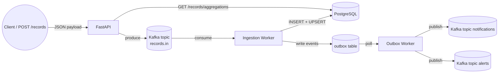

# Implementation Guide

This document explains the entire service: how to run it, how data flows through the system, and what each component does.

## Architecture at a Glance



## Components

| Component | Responsibility |
|-----------|----------------|
| **FastAPI (`src/main.py`, `src/api/records.py`)** | Validates incoming records and sends them to Kafka (`records.in`). Exposes `/records/aggregations`, which queries PostgreSQL directly. |
| **PostgreSQL** | Stores raw records, per-destination aggregates, and the outbox table used for reliable messaging. Tables are created at startup via SQLAlchemy metadata. |
| **Kafka** | Acts as the ingestion bus (`records.in`) and the broadcast layer for downstream consumers (`notifications`, `alerts`). |
| **Ingestion worker (`src/workers/ingestion.py`)** | Consumes `records.in`, inserts the record idempotently, upserts the aggregate row, and writes notification/alert payloads into the outbox table in the same transaction. |
| **Outbox worker (`src/workers/outbox_dispatcher.py`)** | Polls the outbox table with `FOR UPDATE SKIP LOCKED`, publishes each payload to Kafka, and marks rows as published. |

## Runtime Workflow

1. **Submit a record**  
   Clients call `POST /records` with a normalized payload. The API validates it and immediately produces the message to Kafka (`records.in`), responding with `202 Accepted`.

2. **Process and persist**  
   The ingestion worker consumes from `records.in`:
   - Inserts the record (`ON CONFLICT DO NOTHING` provides idempotency).
   - Upserts the `(destinationId, reference)` aggregate with the signed value.
   - Emits a notification payload (`{"record": ..., "summary": ...}`) into the outbox table.
   - Emits an alert payload if the record’s `value` exceeds `DEFAULT_ALERT_THRESHOLD`.

3. **Publish notifications**  
   The outbox worker drains rows from the outbox table, publishes them to Kafka (`notifications`, `alerts`), and stamps `published_at`. This guarantees “exactly one message per processed record.”

4. **Query aggregations**  
   `GET /records/aggregations` accepts optional `startTime`, `endTime`, and `type` filters. The repository in `src/repositories/aggregations.py` runs a single SQL statement that groups by `destinationId`, returns all matching records, and includes the running total per destination.

## Quick Start

```bash
cp .env.example .env
docker compose up --build
```

Services exposed:

| Service | Endpoint |
|---------|----------|
| API | http://localhost:8000/health |
| Kafka broker | kafka:9092 (inside the network) |
| PostgreSQL | localhost:5432 |

### Development mode

```bash
docker compose -f docker-compose.dev.yaml up --build
```

The dev compose file bind-mounts the repository and enables auto-reload for the API; workers also run from source so edits apply immediately.

## Example Usage

### Submit a record

```bash
curl -X POST http://localhost:8000/records \
  -H "Content-Type: application/json" \
  -d '{
    "recordId": "rec-001",
    "time": "2024-03-01T12:00:00Z",
    "sourceId": "source-a",
    "destinationId": "dest-123",
    "type": "positive",
    "value": 125.50,
    "unit": "SEK",
    "reference": "invoice-9"
  }'
```

### Query aggregations

```bash
curl "http://localhost:8000/records/aggregations?startTime=2024-03-01T00:00:00Z&type=positive"
```

### Observe notifications/alerts

```bash
docker compose exec kafka kafka-console-consumer \
  --bootstrap-server kafka:9092 \
  --topic notifications \
  --from-beginning

docker compose exec kafka kafka-console-consumer \
  --bootstrap-server kafka:9092 \
  --topic alerts \
  --from-beginning
```

## Reliability Guarantees

- **Idempotency**: `record_id` is the primary key, so duplicates are ignored.
- **Atomicity**: record insert, aggregate update, and outbox writes happen in one transaction.
- **Outbox pattern**: notifications and alerts are only published after they are safely stored; if Kafka is down, rows accumulate in the outbox and publish once the dispatcher catches up.
- **Back-pressure**: the outbox table acts as the buffer, preventing record loss if Kafka is unavailable.


#### ACID + Kafka + Outbox = Exactly-once Effects
- Kafka → at-least-once delivery    
- Outbox + ACID → exactly-once side effects    
- Idempotent insert (recordId PK) → no duplicates    
- Atomic transaction → no partial updates    
- Durability → no lost events    
- Outbox worker → no missed notifications/alerts


## Load testing 
RATE=28 DURATION=3600 CONNECTIONS=50 node loadtest/test.js

## Next Steps

- Add schema migrations
- Add unit/functional/integration tests
