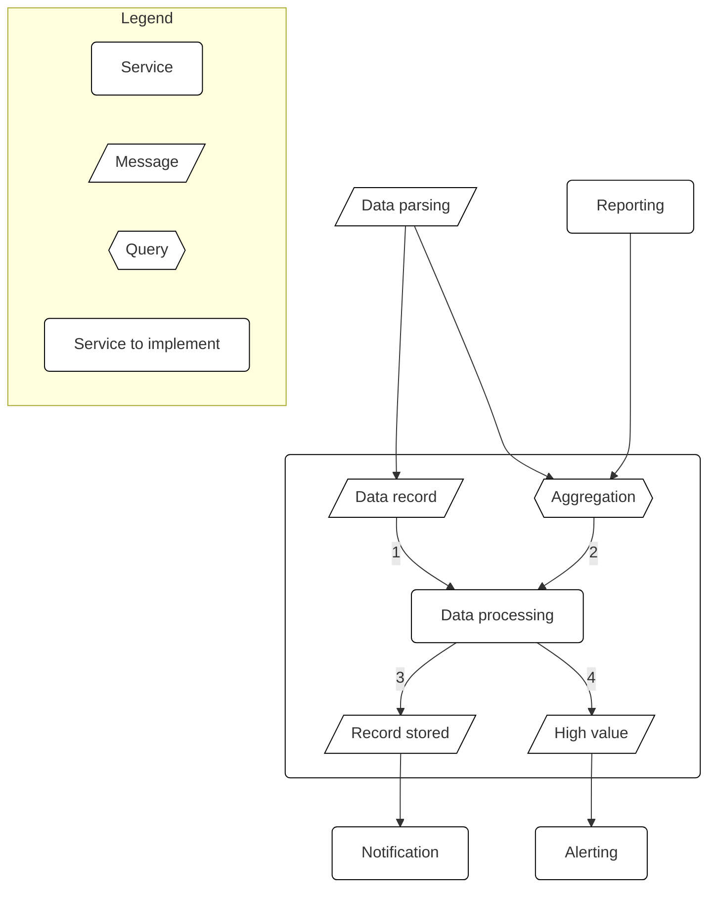
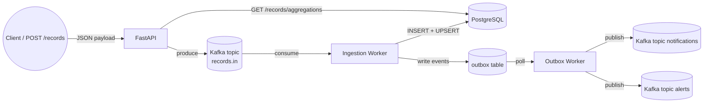

**Table of Contents**

- [Specs](#specs)
  - [Instructions](#instructions)
  - [Requirements](#requirements)
- [Service overview](#service-overview)
- [Plan](#plan)
  - [General idea](#general-idea)
  - [Assumptions](#assumptions)
  - [Performance requirements](#performance-requirements)
  - [Integrity and robustness requirements](#integrity-and-robustness-requirements)
  - [Functional stages](#functional-stages)
  - [Test plan](#test-plan)
- [Implementation Guide](#implementation-guide)
  - [Architecture at a Glance](#architecture-at-a-glance)
  - [Components](#components)
  - [Runtime Workflow](#runtime-workflow)
  - [Quick Start](#quick-start)
    - [Development mode](#development-mode)
  - [Example Usage](#example-usage)
    - [Submit a record](#submit-a-record)
    - [Query aggregations](#query-aggregations)
    - [Observe notifications/alerts](#observe-notificationsalerts)
  - [Reliability Guarantees](#reliability-guarantees)
  - [Next Steps](#next-steps)
- [Load testing](#load-testing)

# Specs

## Interview assignment - Data processing 
Design a micro service that processes standardized data records from multiple sources, supports aggregation and querying functions and feeds downstream services with relevant information. 
### Instructions 
The intended time for this assignment is a maximum of 2 hours. Document your solution in any way you are comfortable with, but be prepared to present it during the interview. The implementation can be in any programming language or even pseudo code. During the interview you will be asked to walk us through it. 
You may choose any tech stack to support the service. Consider quality, scalability and performance. Document the choices and assumptions you make in your design and why. 
### Requirements 
1. Consume input from several services. The service should handle about 100,000 messages per hour efficiently. Implement idempotency to prevent duplicate processing, ensuring each record is processed exactly once. The data structure for incoming records is as follows: 
```json 
{ 
    "recordId": string, 
    "time": Datetime, 
    "sourceId": string, 
    "destinationId": string, 
    "type": string ["positive"|"negative"], 
    "value": Decimal, 
    "unit": string, 
    "reference": string, 
} 
```
2. Respond to queries for aggregation. The query and the response should support the
following. 
   1. Start and end time as optional filters. 
   2. The type of record (positive or negative) as optional filter. 
   3. Grouping by destination id. The response should include all matching records and a summarized total value per group. 
3. Emit messages to be consumed by the notification service. There should be one message for every record processed. Each message should contain the processed record and a summary of any previous ones for the same destination id and reference. 
4. Emit messages to be consumed by alerting service when a record’s value is above a configurable threshold. 

### Service overview 
Below diagram shows the intended place for the transactions service in the larger system.



# Plan
## General idea
Design a micro service that processes standardized data records from multiple sources, supports aggregation and querying functions and feeds downstream services with relevant information. 

## Assumptions
- Uniqueness of the record is given by the record_id. Had it not been the case, we would have needed to compute an unique hash from the record data.

## Performance requirements
100.000 reqs/hour => ~ 28 req/sec

## Integrity and robustness requirements
- **Idempotency**: enforced by `records.record_id` primary key and `ON CONFLICT DO NOTHING`.
- **Atomicity**: ingestion worker inserts records, updates aggregates, and writes outbox events inside a single DB transaction.
- **At-least-once notifications**: outbox table buffers events; dispatcher retries until Kafka publishes succeed.

## Functional stages
1. **Ingestion**: API validates and publishes to Kafka (`records.in`). Worker consumes, writes to Postgres, and emits outbox events.
2. **Notifications/alerts**: Outbox dispatcher publishes to Kafka topics (`notifications`, `alerts`) exactly once.
3. **Query**: FastAPI aggregations endpoint reads directly from `records` with optional time/type filters and groups by destinationId, returning both the records and the per-destination total.


# Implementation
This document explains the entire service: how to run it, how data flows through the system, and what each component does.

## Architecture at a Glance



## Components

| Component | Responsibility |
|-----------|----------------|
| **FastAPI (`src/main.py`, `src/api/records.py`)** | Validates incoming records and sends them to Kafka (`records.in`). Exposes `/records/aggregations`, which queries PostgreSQL directly. |
| **PostgreSQL** | Stores raw records, per-destination aggregates, and the outbox table used for reliable messaging. Tables are created at startup via SQLAlchemy metadata. |
| **Kafka** | Acts as the ingestion bus (`records.in`) and the broadcast layer for downstream consumers (`notifications`, `alerts`). |
| **Ingestion worker (`src/workers/ingestion.py`)** | Consumes `records.in`, inserts the record idempotently, upserts the aggregate row, and writes notification/alert payloads into the outbox table in the same transaction. |
| **Outbox worker (`src/workers/outbox_dispatcher.py`)** | Polls the outbox table with `FOR UPDATE SKIP LOCKED`, publishes each payload to Kafka, and marks rows as published. |

## Runtime Workflow

1. **Submit a record**  
   Clients call `POST /records` with a normalized payload. The API validates it and immediately produces the message to Kafka (`records.in`), responding with `202 Accepted`.

2. **Process and persist**  
   The ingestion worker consumes from `records.in`:
   - Inserts the record (`ON CONFLICT DO NOTHING` provides idempotency).
   - Upserts the `(destinationId, reference)` aggregate with the signed value.
   - Emits a notification payload (`{"record": ..., "summary": ...}`) into the outbox table.
   - Emits an alert payload if the record’s `value` exceeds `DEFAULT_ALERT_THRESHOLD`.

3. **Publish notifications**  
   The outbox worker drains rows from the outbox table, publishes them to Kafka (`notifications`, `alerts`), and stamps `published_at`. This guarantees “exactly one message per processed record.”

4. **Query aggregations**  
   `GET /records/aggregations` accepts optional `startTime`, `endTime`, and `type` filters. The repository in `src/repositories/aggregations.py` runs a single SQL statement that groups by `destinationId`, returns all matching records, and includes the running total per destination.

## Quick Start

```bash
cp .env.example .env
docker compose up --build
```

Services exposed:

| Service | Endpoint |
|---------|----------|
| API | http://localhost:8000/health |
| Kafka broker | kafka:9092 (inside the network) |
| PostgreSQL | localhost:5432 |

## Example Usage

### Submit a record

```bash
curl -X POST http://localhost:8000/records \
  -H "Content-Type: application/json" \
  -d '{
    "recordId": "rec-001",
    "time": "2024-03-01T12:00:00Z",
    "sourceId": "source-a",
    "destinationId": "dest-123",
    "type": "positive",
    "value": 125.50,
    "unit": "SEK",
    "reference": "invoice-9"
  }'
```

### Query aggregations

```bash
curl "http://localhost:8000/records/aggregations?startTime=2024-03-01T00:00:00Z&type=positive"
```

### Observe notifications/alerts

```bash
docker compose exec kafka kafka-console-consumer \
  --bootstrap-server kafka:9092 \
  --topic notifications \
  --from-beginning

docker compose exec kafka kafka-console-consumer \
  --bootstrap-server kafka:9092 \
  --topic alerts \
  --from-beginning
```

### Reliability Guarantees

- **Idempotency**: `record_id` is the primary key, so duplicates are ignored.
- **Atomicity**: record insert, aggregate update, and outbox writes happen in one transaction.
- **Outbox pattern**: notifications and alerts are only published after they are safely stored; if Kafka is down, rows accumulate in the outbox and publish once the dispatcher catches up.
- **Back-pressure**: the outbox table acts as the buffer, preventing record loss if Kafka is unavailable.

#### ACID + Kafka + Outbox = Exactly-once Effects
- Kafka → at-least-once delivery    
- Outbox + ACID → exactly-once side effects    
- Idempotent insert (recordId PK) → no duplicates    
- Atomic transaction → no partial updates    
- Durability → no lost events    
- Outbox worker → no missed notifications/alerts


## Load testing
RATE=28 DURATION=3600 CONNECTIONS=50 node loadtest/test.js

## Next Steps

- Add schema migrations
- Add unit/functional/integration tests
